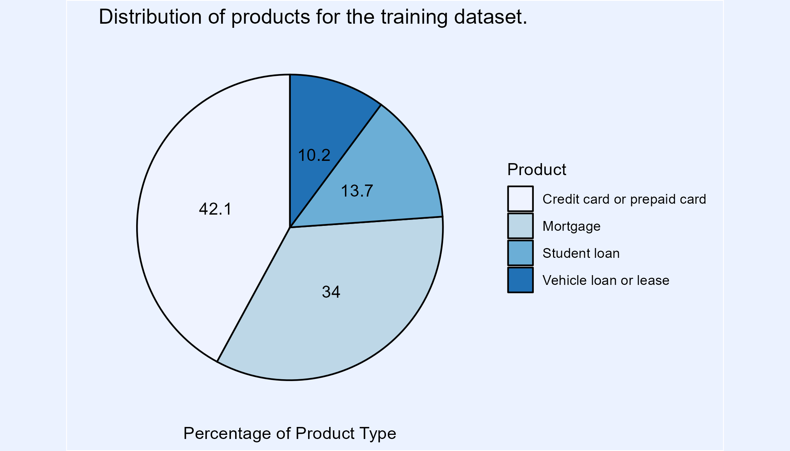
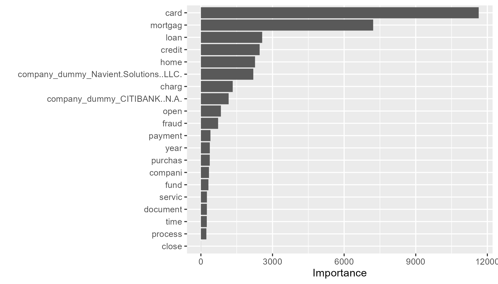
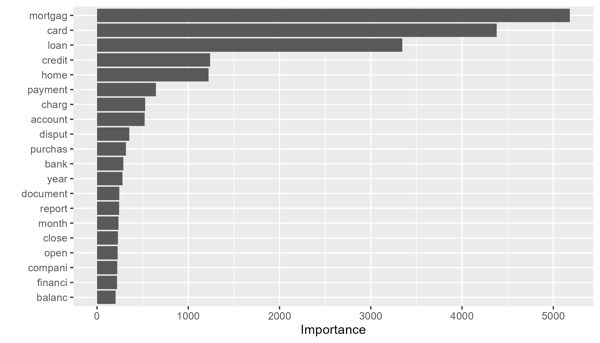
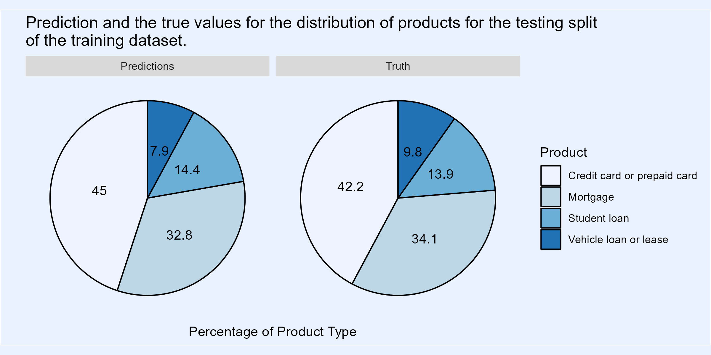

```{r setup_chunks, include=FALSE}
knitr::opts_chunk$set(
  collapse = TRUE,
  comment = "#>",
  fig.path = "images/",
  out.width = "100%",
  message = FALSE,
  warning = FALSE
)
```

## Load Packages

```{r load_packages}
library(readr)
library(here)
library(tidyverse)
library(tidytext)
library(tidymodels)
library(SnowballC)
library(tm)
library(rsample)
library(recipes)
library(rpart)
library(tune)
library(vip)
library(workflows)
library(randomForest)
```

## Load data sets

```{r load_datasets}
complaints_train <- read_csv(here::here("data", "raw_data", "data_complaints_train.csv")) |> 
  janitor::clean_names()

# organize variable names and types
complaints_train <- complaints_train |> 
  select(-submitted_via) |> 
  mutate(complaint_id = as.factor(row_number()), .before = everything(),
         product = as.factor(product)) |> 
  rename(complaint = consumer_complaint_narrative)
complaints_train

complaints_test <- read_csv(here::here("data", "raw_data", "data_complaints_test.csv")) |>
  janitor::clean_names() |> 
  select(-submitted_via) |> 
  rename(complaint = consumer_complaint_narrative)
complaints_test

# save(complaints_train, complaints_test, file = here::here("data", "tidy_data", "project_5.rda"))
```

## Explore data

```{r explore_data}
head(complaints_train)
glimpse(complaints_train)
head(complaints_test)
glimpse(complaints_test)

skimr::skim(complaints_train)
skimr::skim(complaints_test)
```

For the training data we have initially 90'975 complaints (rows) and 6 total variables (columns) where no values are missing. We have 4 different products for which the distribution can be seen in the following plot.

```{r plot_product_distribution}
complaints_train |> 
  group_by(product) |> 
  summarise(count = n()) |> 
  mutate(percent = count / sum(count) * 100 ) |>  
  ungroup() |>  
  arrange(desc(count)) |> 
  ggplot(aes(x = "", y = percent, fill = product)) +
  geom_col(color = "black") +
  geom_text(aes(label = round(percent, digits = 1)),
            position = position_stack(vjust = 0.5)) +
  coord_polar(theta = "y") +
  scale_fill_brewer() +
  labs(title = "Distribution of products for the training dataset.",
       x = "",
       y = "Percentage of Product Type") +
  guides(fill = guide_legend(title = "Product")) +
  theme(axis.text = element_blank(),
        axis.ticks = element_blank(),
        panel.grid = element_blank(),
        panel.background = element_rect(fill = "#ebf2ff"),
        plot.background = element_rect(fill = "#ebf2ff"),
        legend.background = element_rect(fill = "#ebf2ff"))

ggsave(here::here("images", "distribution-training.png"), width= 7, height = 4)

```



There is no clear tendency visible between the length of a complaint and the product type. Only the complaints in the Mortgage category are slightly longer than the rest.

```{r plot_histogramm}
complaints_train |> 
  mutate(textlength = nchar(complaint), .after = complaint) |> 
  ggplot(mapping = aes(x = textlength)) +
  geom_histogram(binwidth = 200) +
  scale_x_continuous(limits = c(0, 4000)) + 
  facet_grid(product ~ .) + 
  labs(y = "Product", x = "Length of text in characters", title = "Histogram of the length of the complaints for each category") +
  theme_light()
  
ggsave(here::here("images", "histogram-training.png"), width= 7, height = 4)
  
complaints_train |> 
  mutate(textlength = nchar(complaint), .after = complaint) |> 
  ggplot(mapping = aes(x = textlength, product)) +
  geom_boxplot(outlier.shape = NA) +
  scale_x_continuous(limits = c(0, 3500)) + 
  labs(y = "Product", x = "Length of text in characters", title = "Boxplot of the length of the complaints for each category") +
  theme_light()

ggsave(here::here("images", "boxplot-training.png"), width= 7, height = 4)
```


## Term frequency

From the exploring of the data, no correlation between the different variables were visible. The most promising way to design the model is to create a matrix with how frequent a given word appears for a given complaint and use it as features for a machine learning algorithm. In the following the matrix is generated.

### Data preparation

#### Reducing Sample Size for Concept Proving

```{r reduce_size}
# set.seed(1234)
# # reduce sample size
# complaints_train <- complaints_train |>
#   sample_n(1000)
```

#### Create tidy data set

First, tidy the data to have a little bit and remove the X's and numbers.

```{r tidy_data}
complaints_train_tidy <- complaints_train |> 
  mutate(
    # lower case
    complaint = str_to_lower(complaint),
    
    # remove any strings such as "XX", "XXX", "XXXX" in the complaints
    complaint = str_replace_all(complaint, "xx+", "")) |> 
  
   # remove digits and punctuation
  mutate(
    complaint = removePunctuation(complaint),
    complaint = stripWhitespace(complaint),
    complaint = str_replace_all(complaint,'[0-9]+', ""),
    complaint = str_trim(complaint)
  )
```

### Variation 2

I tried out different ways to implement the model. Some included manipulating the complaints within the tibble, creating the DTM and narrowing the terms later. Different methods to create and manipulate the dtm were also explored. There was no specific reason for staying with this variation and later in the project I discovered more convenient methods that might have done this better/prettier.

```{r create_dtm}
complaints_corpus2 <- Corpus(VectorSource(complaints_train_tidy$complaint))
print(complaints_corpus2)

inspect(complaints_corpus2[1:5])

complaints_corpus_dtm2 <- DocumentTermMatrix(complaints_corpus2,
                                             control = list(
                                       stripWhitespace = TRUE,
                                       stopwords = TRUE,
                                       stemming = TRUE,
                                       removeNumbers = TRUE,
                                       wordLengths = c(4, Inf),
                                       removePunctuation = TRUE
                                       ))
```

#### Inspection

As you can see the Matrix is very big.

```{r inspect_dtm}
inspect(complaints_corpus_dtm2)
```

```         
<<DocumentTermMatrix (documents: 90975, terms: 52200)>>
Non-/sparse entries: 5778682/4743116318
Sparsity           : 100%
Maximal term length: 1961
Weighting          : term frequency (tf)
Sample             :
       Terms
Docs    account call card credit loan month payment receiv time told
  19650       4    8    0      4   51     1      13     21   10    0
  25455      97    0    0     15   81    12      33      5    4    0
  27671       3    1    0      1    4     0      13      3    4    0
  33614       5    2    7      6    8     2       1     20    5    0
  58908      24    1    0     27   62    63      54      3   19    0
  64243       0   14    0      0   84     7      11     11   23    2
  70389       1    1    2      4    6     3       3      2    0    0
  73540      16    5    0      9   64     4      44      6   11    0
  77518       0    0    0      0  854    16      46      0    0    2
  84551      58    0    0     12   70     6      38      0    8    0
```

#### Remove Sparse Terms

```{r spars_dtm}
# complaints_dtm <- removeSparseTerms(complaints_corpus_dtm2, 0.90)
complaints_dtm <- removeSparseTerms(complaints_corpus_dtm2, 0.95)
# complaints_dtm <- removeSparseTerms(complaints_corpus_dtm2, 0.97)

inspect(complaints_dtm)
```

```         
<<DocumentTermMatrix (documents: 90975, terms: 312)>>
Non-/sparse entries: 3526661/24857539
Sparsity           : 88%
Maximal term length: 10
Weighting          : term frequency (tf)
Sample             :
       Terms
Docs    account call card credit loan month payment receiv time told
  11002       1    0    0      1   70     5       8     11   15    1
  19650       4    8    0      4   51     1      13     21   10    0
  25455      97    0    0     15   81    12      33      5    4    0
  37990      20   32    0     11   47    11      10     31   12    9
  56802      20   10    0      0    6     9      34     28   14    8
  60769       0   27    6      5   47    12      11     30   17   18
  68621      11   15    0     10   67     8      25     21   23    8
  73540      16    5    0      9   64     4      44      6   11    0
  77518       0    0    0      0  854    16      46      0    0    2
  84551      58    0    0     12   70     6      38      0    8    0
```

### Add meta data

```{r merge_dtm_train}
create_matrix <- function(dtm, meta){
  complaints_matrix <- as.matrix(dtm)
  complaints_matrix
  
  model_matrix <- meta |> 
    cbind(complaints_matrix) |>
    as_tibble()
  
  return(model_matrix)
}

complaints_meta <- complaints_train |> 
  select(-complaint) |> 
  rename(product_value = product,
         company_dummy = company,
         state_dummy = state)

corpus_model2 <- create_matrix(complaints_dtm, complaints_meta)

```

# Modeling

## Model 1: Classification And Regression Tree (CART) using rpart

```{r rpart_define_data}
complaints_modeling <- corpus_model2
```

### Step 1: Data Splitting with rsample

```{r rpart_split}
# ensure the split is done the same if code is rerun
set.seed(1234)
# split data set into test and training
split_complaints <- initial_split(complaints_modeling, prop = 2/3) 
split_complaints
```

```         
<Training/Testing/Total>
<60650/30325/90975>
```

```{r rpart_train_test}
training_complaints <- training(split_complaints)
count(training_complaints, product_value)

testing_complaints <-testing(split_complaints)
count(testing_complaints, product_value)
```

### Step 2: Create recipe with recipe()

```{r rpart_recipe}
complaints_recipe <- training_complaints |>
  recipe(product_value ~ .) |> 
  update_role(complaint_id, new_role = "comlaint id") |> 
  # Specify preprocessing steps 
  step_dummy(state_dummy, company_dummy, zip_code, one_hot = TRUE) |> 
  step_nzv(all_predictors()) #|> 
  # step_corr(all_predictors())
complaints_recipe

summary(complaints_recipe)
```

```         
── Recipe ─────────────────────────────────────────────────────────────────────────────────────────────────────────────────────────────────

── Inputs 
Number of variables by role
outcome:       1
predictor:   315
comlaint id:   1

── Operations 
• Dummy variables from: state_dummy, company_dummy, zip_code
• Sparse, unbalanced variable filter on: all_predictors()
```

#### Check the preprocessing

```{r rpart_check_prep}
prepped_rec <- prep(complaints_recipe, verbose = TRUE, retain = TRUE)

names(prepped_rec)
```

```         
oper 1 step dummy [training] 
oper 2 step nzv [training] 
The retained training set is ~ 122.19 Mb  in memory.

 [1] "var_info"       "term_info"      "steps"          "template"       "levels"   [6] "retained"       "requirements"   "tr_info"        "orig_lvls"
 [10]"last_term_info"
```

##### Take a look at preprocessed training data

```{r rpart_look}
preproc_train <- bake(prepped_rec, new_data = NULL)
# glimpse(preproc_train)
```

##### Extract preprocessed testing data using bake()

```{r rpart_extract_prep}
baked_test_complaints <- bake(prepped_rec, new_data = testing_complaints)
# glimpse(baked_test_complaints)
```

### Step 3: Specify model, engine, and mode using parsnip

```{r rpart_model}
complaints_model <- 
  # define Model (Classification And Regression Tree (CART))
  parsnip::decision_tree() |>
  #set engine (rpart)
  parsnip::set_engine("rpart") |>
  # set mode (classification)
  parsnip::set_mode("classification")

complaints_model
```

```         
Decision Tree Model Specification (classification)

Computational engine: rpart 
```

### Step 4: Create workflow, add recipe, add model

```{r rpart_workflow}
prod_comp_wflow <- workflows::workflow() |>
                   workflows::add_recipe(complaints_recipe) |>
                   workflows::add_model(complaints_model)

prod_comp_wflow
```

### Step 5.1 Fit model to training data

```{r rpart_fit}
doParallel::registerDoParallel(cores=11)

prod_comp_wflow_fit <- parsnip::fit(prod_comp_wflow, data = training_complaints)

prod_comp_wflow_fit

```

```         
 ══ Workflow [trained] ═══════════════════════════════════════════════════════════════════════════════════════════════
Preprocessor: Recipe
Model: decision_tree()

── Preprocessor ─────────────────────────────────────────────────────────────────────────────────────────────────────
2 Recipe Steps

• step_dummy()
• step_nzv()

── Model ────────────────────────────────────────────────────────────────────────────────────────────────────────────
n= 60650 

node), split, n, loss, yval, (yprob)
      * denotes terminal node
```

#### Assessing the Model Fit

```{r rpart_assess_fit}
wf_fit_comp <- prod_comp_wflow_fit |> 
  extract_fit_parsnip()
```

#### Explore Variable importance

```{r rpart_importance}
broomstick::tidy(wf_fit_comp) |> head(n = 20)

prod_comp_wflow_fit |>
  extract_fit_parsnip() |>  
  vip(num_features = 20)

ggsave(here::here("images", "importance.png"), width= 7, height = 4)
```



### Step 6: Get predictions

#### Pull out our predicted outcome values

```{r rpart_pull_fail}
# wf_fitted_values <- 
#   broomstick::augment(wf_fit_comp, new_data = training_complaints)
# broom::augment()
# head(wf_fitted_values)
```

```{r rpart_merge_pred}
pred_products <- predict(prod_comp_wflow_fit, new_data = training_complaints)

values_pred <- pred_products |> 
  bind_cols(training_complaints |> select(product_value, complaint_id, company_dummy, state_dummy, zip_code))
values_pred

```

```         
 # A tibble: 60,650 × 6
   .pred_class       product_value complaint_id company_dummy state_dummy
   <fct>             <fct>         <fct>        <chr>         <chr>      
 1 Student loan      Student loan  41964        HEARTLAND PA… NY         
 2 Student loan      Mortgage      15241        NATIONSTAR M… VA         
 3 Student loan      Student loan  33702        AES/PHEAA     NJ         
 4 Mortgage          Mortgage      83023        U.S. BANCORP  MI         
 5 Student loan      Student loan  80756        Performant F… CA         
 6 Student loan      Student loan  85374        AES/PHEAA     OH         
 7 Student loan      Mortgage      68158        RUSHMORE LOA… NY         
 8 Student loan      Student loan  59944        Navient Solu… MI         
 9 Credit card or p… Credit card … 68536        U.S. BANCORP  NC         
10 Mortgage          Vehicle loan… 17380        ALLY FINANCI… ME         
# ℹ 60,640 more rows
# ℹ 1 more variable: zip_code <chr>
# ℹ Use `print(n = ...)` to see more rows
```

#### Visualizing Model Performance

```{r rpart_plot_pred}
values_pred |>
  pivot_longer(c(.pred_class, product_value), names_to = "pred_or_orig", values_to = "products") |> 
  group_by(products, pred_or_orig) |> 
  summarise(count = n()) |> 
  group_by(pred_or_orig) |> 
  mutate(percent = count / sum(count) * 100) |>   
  ungroup() |>  
  arrange(desc(count)) |> 
  ggplot(aes(x = "", y = percent, fill = products)) +
  facet_grid(cols = vars(pred_or_orig),
             labeller = as_labeller(c(.pred_class = "Predictions",
                                      product_value = "Truth"))) +
  geom_col(color = "black") +
  geom_text(aes(label = round(percent, digits = 1)),
            position = position_stack(vjust = 0.5)) +
  coord_polar(theta = "y") +
  scale_fill_brewer() +
  labs(title = "Prediction and the true values for the distribution of products for the training dataset.",
       x = "",
       y = "Percentage of Product Type") +
  guides(fill = guide_legend(title = "Product")) +
  theme(axis.text = element_blank(),
        axis.ticks = element_blank(),
        panel.grid = element_blank(),
        panel.background = element_rect(fill = "#ebf2ff"),
        plot.background = element_rect(fill = "#ebf2ff"),
        legend.background = element_rect(fill = "#ebf2ff"))

ggsave(here::here("images", "pred-true-model-1.png"), width= 8, height = 4)
```


Looking at the graph, we can see that the performance of the model on the training data is not very satisfying. Especially the "Vehicle loan or lease" category is not recognized and instead the "Creadit card or prepaid card" category is predicted to often.

#### Quantifying Model Performance

To how the effectivness of the model we also calculate the accuracy of the prediction which is 0.799, but we want to achieve at least 0.8 (to hopefully pass the test;) if not more.

```{r rpart_perform}
yardstick::accuracy(values_pred, 
                truth = product_value, estimate = .pred_class)

count(values_pred, product_value)
count(values_pred, .pred_class)
```

```         
# A tibble: 1 × 3
  .metric  .estimator .estimate
  <chr>    <chr>          <dbl>
1 accuracy multiclass     0.799
```

### Assessing Model Performance on v-folds

So we want to see if a better performance is possible using v-folds cross validation.

#### Step 1.2 Split training set into cross validation sets

```{r rpart_vfold}
set.seed(1234)
vfold_complaints <- rsample::vfold_cv(data = training_complaints, v = 5)
vfold_complaints

pull(vfold_complaints, splits)
```

```{r rpart_explore_vfold}
# Explore one of the folds
first_fold <- vfold_complaints$splits[[1]]
head(as.data.frame(first_fold, data = "analysis")) # training set of this fold

head(as.data.frame(first_fold, data = "assessment")) # test set of this fold
```

### Step 5.2: Fit workflow with cross validation

```{r rpart_resample}
doParallel::registerDoParallel(cores=11)
set.seed(122)
resample_fit <- tune::fit_resamples(prod_comp_wflow, vfold_complaints)

resample_fit

collect_metrics(resample_fit)

show_best(resample_fit, metrics = "accuracy")
```

```         
# A tibble: 2 × 6
  .metric  .estimator  mean     n std_err .config             
  <chr>    <chr>      <dbl> <int>   <dbl> <chr>               
1 accuracy multiclass 0.795     5 0.00313 Preprocessor1_Model1
2 roc_auc  hand_till  0.871     5 0.0121  Preprocessor1_Model1
```

We see that the best case doesn't achieve the 80 percent accuracy either. Also the area under the receiver operator curve can be improved and that's why we try an other model, the random forest model.

## Model 2: Random Forest

### Prepare Model data

We remove any additional variables to simplify the model. In this case it will now only be based on the text analysis of the complaints.

```{r rf_define_data}
complaints_modeling <- complaints_modeling |> 
  select(-c(company_dummy, state_dummy, zip_code))
```

### Step 1: Data Splitting with rsample again

```{r rf_split}
# ensure the split is done the same if code is rerun
set.seed(1234)
# split data set into test and training
split_complaints <- initial_split(complaints_modeling, prop = 2/3) 
split_complaints
```

```{r rf_train_test}
training_complaints <- training(split_complaints)
count(training_complaints, product_value)

testing_complaints <-testing(split_complaints)
count(testing_complaints, product_value)
```

### Step 2: Create recipe with recipe()

```{r rf_recipe}
RF_complaints_recipe <- training_complaints |>
  recipe(product_value ~ .) |> 
  update_role(complaint_id, new_role = "comlaint id") |> 
  # Specify preprocessing steps 
  # step_novel(company_dummy) |> 
  step_nzv(all_predictors()) #|> 
  # step_corr(all_predictors())
RF_complaints_recipe

summary(RF_complaints_recipe)
```

```         
── Recipe ───────────────────────────────────────────────────────────────────────────────────────────────────────────

── Inputs 
Number of variables by role
outcome:       1
predictor:   312
comlaint id:   1

── Operations 
• Sparse, unbalanced variable filter on: all_predictors()
```

### Step 3: Specify model, engine, and mode using parsnip

```{r rf_model}
RF_complaints_model <- 
  # define Model (Classification And Regression Tree (CART))
  parsnip::rand_forest(mtry = 10, min_n = 4) |>
  #set engine (rpart)
  parsnip::set_engine("randomForest") |>
  # set mode (classification)
  parsnip::set_mode("classification")

RF_complaints_model
```

### Step 4: Create workflow, add recipe, add model

```{r rf_workflow}
RF_wflow <- workflows::workflow() |> 
            workflows::add_recipe(RF_complaints_recipe) |> 
            workflows::add_model(RF_complaints_model)
RF_wflow
```

### Step 5.1 Fit workflow with cross validation

```{r rf_fit}
doParallel::registerDoParallel(cores=11)
RF_wflow_fit <- parsnip::fit(RF_wflow, data = training_complaints)
RF_wflow_fit
```

```         
══ Workflow [trained] ═════════════════════════════════════════════════════════════════════════════════════════════════════════════════════════════════════════════
Preprocessor: Recipe
Model: rand_forest()

── Preprocessor ───────────────────────────────────────────────────────────────────────────────────────────────────────────────────────────────────────────────────
1 Recipe Step

• step_nzv()

── Model ──────────────────────────────────────────────────────────────────────────────────────────────────────────────────────────────────────────────────────────

Call:
 randomForest(x = maybe_data_frame(x), y = y, mtry = min_cols(~10,      x), nodesize = min_rows(~4, x)) 
               Type of random forest: classification
                     Number of trees: 500
No. of variables tried at each split: 10

        OOB estimate of  error rate: 16.62%
Confusion matrix:
                            Credit card or prepaid card Mortgage Student loan Vehicle loan or lease class.error
Credit card or prepaid card                       24861      473           65                   100  0.02502059
Mortgage                                           1060    18652          804                    98  0.09517803
Student loan                                        868     1586         5633                   189  0.31935718
Vehicle loan or lease                              2154     1581         1104                  1422  0.77287973
```

#### Explore Variable importance using vip()

The importance has changed slightly, but the main drivers are still the same...

```{r rf_importance}
RF_wflow_fit |> 
  pull_workflow_fit() |> 
  vip(num_features = 20)

ggsave(here::here("images", "rf-importance.png"), width= 7, height = 4)
```



### Skip Step 6:

### Assessing Model Performance on v-folds using tune

#### Step 1.2 Split training set into cross validation sets

```{r rf_vfold}
set.seed(1234)
vfold_complaints <- rsample::vfold_cv(data = training_complaints, v = 5)
vfold_complaints

pull(vfold_complaints, splits)
```

```{r rf_resample}
set.seed(456)
resample_RF_fit <- tune::fit_resamples(RF_wflow, vfold_complaints)
collect_metrics(resample_RF_fit)
```

```         
# A tibble: 2 × 6
  .metric  .estimator  mean     n  std_err .config             
  <chr>    <chr>      <dbl> <int>    <dbl> <chr>               
1 accuracy multiclass 0.835     5 0.00140  Preprocessor1_Model1
2 roc_auc  hand_till  0.932     5 0.000900 Preprocessor1_Model1
```

The metrics have improved with this model and the parameters we used for `mtry` (= 10) and `min_n` (= 4). Let's see, if we can get even better performance by tuning these parameters.

### Model Tuning

#### Step 3.2: Specify hyperparameters to tune (tune())

```{r rf_tune_model}
tune_RF_model <- 
  rand_forest(mtry = tune(), min_n = tune()) |>
  set_engine("randomForest") |>
  set_mode("classification")
tune_RF_model
```

### Step 4.2:

```{r rf_tune_workflow}
RF_tune_wflow <- workflows::workflow() %>%
            workflows::add_recipe(RF_complaints_recipe) %>%
            workflows::add_model(tune_RF_model)
RF_tune_wflow
```

```         
══ Workflow ══════════════════════════════════════════════════════════════════════════════════════════════════════════════
Preprocessor: Recipe
Model: rand_forest()

── Preprocessor ──────────────────────────────────────────────────────────────────────────────────────────────────────────
1 Recipe Step

• step_nzv()

── Model ─────────────────────────────────────────────────────────────────────────────────────────────────────────────────
Random Forest Model Specification (classification)

Main Arguments:
  mtry = tune()
  min_n = tune()

Computational engine: randomForest 
```

#### Step 5.3: Fit workflow with tuning

```{r rf_tune_fit}
doParallel::registerDoParallel(cores=11)
set.seed(123)
tune_RF_results <- tune::tune_grid(RF_tune_wflow, resamples = vfold_complaints)

tune_RF_results |> 
  collect_metrics()
```

```         
# A tibble: 20 × 8
    mtry min_n .metric  .estimator  mean     n  std_err .config              
   <int> <int> <chr>    <chr>      <dbl> <int>    <dbl> <chr>                
 1    60    30 accuracy multiclass 0.850     5 0.00130  Preprocessor1_Model01
 2    60    30 roc_auc  hand_till  0.936     5 0.000869 Preprocessor1_Model01
 3   220     3 accuracy multiclass 0.846     5 0.00108  Preprocessor1_Model02
 4   220     3 roc_auc  hand_till  0.934     5 0.000867 Preprocessor1_Model02
 5    29    39 accuracy multiclass 0.847     5 0.00125  Preprocessor1_Model03
 6    29    39 roc_auc  hand_till  0.935     5 0.000819 Preprocessor1_Model03
 7    98    27 accuracy multiclass 0.849     5 0.000878 Preprocessor1_Model04
 8    98    27 roc_auc  hand_till  0.936     5 0.000806 Preprocessor1_Model04
 9   215    36 accuracy multiclass 0.844     5 0.00105  Preprocessor1_Model05
10   215    36 roc_auc  hand_till  0.933     5 0.000821 Preprocessor1_Model05
11    88    20 accuracy multiclass 0.851     5 0.000927 Preprocessor1_Model06
12    88    20 roc_auc  hand_till  0.936     5 0.000839 Preprocessor1_Model06
13   125    24 accuracy multiclass 0.848     5 0.000859 Preprocessor1_Model07
14   125    24 roc_auc  hand_till  0.935     5 0.000811 Preprocessor1_Model07
15   189    12 accuracy multiclass 0.848     5 0.000864 Preprocessor1_Model08
16   189    12 roc_auc  hand_till  0.934     5 0.000856 Preprocessor1_Model08
17   159    15 accuracy multiclass 0.848     5 0.000925 Preprocessor1_Model09
18   159    15 roc_auc  hand_till  0.935     5 0.000921 Preprocessor1_Model09
19    19     7 accuracy multiclass 0.848     5 0.00159  Preprocessor1_Model10
20    19     7 roc_auc  hand_till  0.935     5 0.000920 Preprocessor1_Model10
```

```{r rf_tune_best_accuracy}
tune::show_best(tune_RF_results, metric = "accuracy")
tune::show_best(tune_RF_results, metric = "roc_auc")

```

```         
# A tibble: 5 × 8
   mtry min_n .metric  .estimator  mean     n  std_err .config              
  <int> <int> <chr>    <chr>      <dbl> <int>    <dbl> <chr>                
1    88    20 accuracy multiclass 0.851     5 0.000927 Preprocessor1_Model06
2    60    30 accuracy multiclass 0.850     5 0.00130  Preprocessor1_Model01
3    98    27 accuracy multiclass 0.849     5 0.000878 Preprocessor1_Model04
4   159    15 accuracy multiclass 0.848     5 0.000925 Preprocessor1_Model09
5   125    24 accuracy multiclass 0.848     5 0.000859 Preprocessor1_Model07
```

```{r rf_tune_best_rocauc}
tune::show_best(tune_RF_results, metric = "roc_auc") 
```

```         
# A tibble: 5 × 8
   mtry min_n .metric .estimator  mean     n  std_err .config              
  <int> <int> <chr>   <chr>      <dbl> <int>    <dbl> <chr>                
1    60    30 roc_auc hand_till  0.936     5 0.000869 Preprocessor1_Model01
2    88    20 roc_auc hand_till  0.936     5 0.000839 Preprocessor1_Model06
3    98    27 roc_auc hand_till  0.936     5 0.000806 Preprocessor1_Model04
4    29    39 roc_auc hand_till  0.935     5 0.000819 Preprocessor1_Model03
5   125    24 roc_auc hand_till  0.935     5 0.000811 Preprocessor1_Model07
```

From the tuning valuation we see that the best results for accuracy are achieved with the following parameters:

-   `mtry = 88`

-   `min_n = 20`

Leading to a accuracy of 0.851 and an area under receiver operator curve of 0.936.

### Final Model performance evaluation

#### Select best tuning values for final fit

```{r final_values}
# Select best tuning values
tuned_RF_values<- select_best(tune_RF_results, metric = "accuracy")
tuned_RF_values
```

#### Create workflow for final fit

```{r final_workflow}
# create final workflow
RF_tuned_wflow <-RF_tune_wflow |> 
  tune::finalize_workflow(tuned_RF_values)
RF_tuned_wflow
```

```         
> RF_tuned_wflow
══ Workflow ══════════════════════════════════════════════════════════════════════════════════════════════════════════════
Preprocessor: Recipe
Model: rand_forest()

── Preprocessor ──────────────────────────────────────────────────────────────────────────────────────────────────────────
1 Recipe Step

• step_nzv()

── Model ─────────────────────────────────────────────────────────────────────────────────────────────────────────────────
Random Forest Model Specification (classification)

Main Arguments:
  mtry = 88
  min_n = 20

Computational engine: randomForest 
```

#### Perform final fit

```{r final_fit}
doParallel::registerDoParallel(cores=11)

overallfit <-tune::last_fit(RF_tuned_wflow, split = split_complaints)
overallfit
```

```{r final_collect}
collect_metrics(overallfit)
```

```         
# A tibble: 2 × 4
  .metric  .estimator .estimate .config             
  <chr>    <chr>          <dbl> <chr>               
1 accuracy multiclass     0.854 Preprocessor1_Model1
2 roc_auc  hand_till      0.936 Preprocessor1_Model1
```

The application on the test split data shows that the model performs similarly to the test split as for the training split data.

```{r}
test_predictions <- collect_predictions(overallfit)
```

```{r}
test_predictions |> 
  select(-id) |> 
  relocate(.pred_class, product_value, .before = `.pred_Credit card or prepaid card`) |> 
  head(n = 15)
```

```         
# A tibble: 15 × 8
   .pred_class              product_value .pred_Credit card or…¹ .pred_Mortgage
   <fct>                    <fct>                          <dbl>          <dbl>
 1 Credit card or prepaid … Credit card …                  0.426          0.182
 2 Mortgage                 Credit card …                  0.36           0.52 
 3 Credit card or prepaid … Credit card …                  0.872          0.044
 4 Vehicle loan or lease    Mortgage                       0.012          0.404
 5 Credit card or prepaid … Credit card …                  0.998          0    
 6 Mortgage                 Mortgage                       0              0.998
 7 Credit card or prepaid … Credit card …                  0.996          0.002
 8 Vehicle loan or lease    Vehicle loan…                  0.346          0.088
 9 Mortgage                 Mortgage                       0.004          0.994
10 Credit card or prepaid … Mortgage                       1              0    
11 Student loan             Mortgage                       0              0.086
12 Mortgage                 Mortgage                       0              1    
13 Student loan             Mortgage                       0.01           0.364
14 Credit card or prepaid … Credit card …                  0.988          0.002
15 Mortgage                 Mortgage                       0              1    
# ℹ abbreviated name: ¹​`.pred_Credit card or prepaid card`
# ℹ 4 more variables: `.pred_Student loan` <dbl>,
#   `.pred_Vehicle loan or lease` <dbl>, .row <int>, .config <chr>
```

### Plot

```{r}
test_predictions |>
  pivot_longer(c(.pred_class, product_value), names_to = "pred_or_orig", values_to = "products") |> 
  group_by(products, pred_or_orig) |> 
  summarise(count = n()) |> 
  group_by(pred_or_orig) |> 
  mutate(percent = count / sum(count) * 100) |>   
  ungroup() |>  
  arrange(desc(count)) |> 
  ggplot(aes(x = "", y = percent, fill = products)) +
  facet_grid(cols = vars(pred_or_orig),
             labeller = as_labeller(c(.pred_class = "Predictions",
                                      product_value = "Truth"))) +
  geom_col(color = "black") +
  geom_text(aes(label = round(percent, digits = 1)),
            position = position_stack(vjust = 0.5)) +
  coord_polar(theta = "y") +
  scale_fill_brewer() +
  labs(title = "Prediction and the true values for the distribution of products for the testing split \nof the training dataset.",
       x = "",
       y = "Percentage of Product Type") +
  guides(fill = guide_legend(title = "Product")) +
  theme(axis.text = element_blank(),
        axis.ticks = element_blank(),
        panel.grid = element_blank(),
        panel.background = element_rect(fill = "#ebf2ff"),
        plot.background = element_rect(fill = "#ebf2ff"),
        legend.background = element_rect(fill = "#ebf2ff"))

ggsave(here::here("images", "pred-true-model-final.png"), width= 8, height = 4)
```



As one can see, the good (but not perfect!) fit of the final model is also visible in this visualization of the distribution of the different complaint/product categories.

## Application of Final Model on Test Dataset

Finaly, we have to apply the model to our test dataset. Therefore, we have to perform the same preprocessing steps as done with the traininig dataset.

### Prepare Model data

```{r rf_define_data}
# complaints_modeling <- complaints_modeling |> 
#   select(-c(company_dummy, state_dummy, zip_code))
```

### Step 1: Data Splitting with rsample

```{r rf_split}
# ensure the split is done the same if code is rerun
set.seed(1234)
# split data set into test and training
split_complaints <- initial_split(complaints_modeling, prop = 2/3) 
split_complaints
```

```{r rf_train_test}
training_complaints <- training(split_complaints)
count(training_complaints, product_value)

testing_complaints <-testing(split_complaints)
count(testing_complaints, product_value)
```

### Step 2: Create recipe with recipe()

```{r rf_recipe}
final_recipe <- training_complaints |>
  recipe(product_value ~ .) |> 
  update_role(complaint_id, new_role = "complaint id") |> 
  step_nzv(all_predictors())
final_recipe
```

### Step 3: Specify model, engine, and mode using parsnip

```{r rf_model}
final_model <- 
  # define Model (Random Forest and paramaters)
  parsnip::rand_forest(mtry = 88, min_n = 20) |>
  #set engine (rpart)
  parsnip::set_engine("randomForest") |>
  # set mode (classification)
  parsnip::set_mode("classification")

final_model
```

### Step 4: Create workflow, add recipe, add model

```{r rf_workflow}
final_wflow <- workflows::workflow() |> 
            workflows::add_recipe(final_recipe) |> 
            workflows::add_model(final_model)
final_wflow
```

### Step 5.1 Fit workflow with cross validation

```{r rf_fit}
doParallel::registerDoParallel(cores=11)

final_fit <- parsnip::fit(RF_wflow, data = training_complaints)
final_fit
```

### Skip Step 6:

### Assessing Model Performance on v-folds using tune

#### Step 1.2 Split training set into cross validation sets

```{r rf_vfold}
set.seed(1234)
vfold_complaints <- rsample::vfold_cv(data = training_complaints, v = 5)
vfold_complaints

pull(vfold_complaints, splits)
```

```{r}
control <- control_resamples(save_pred = TRUE)
```

```{r rf_resample}
doParallel::registerDoParallel(cores=11)

set.seed(456)
resample_final_fit <- tune::fit_resamples(final_wflow, vfold_complaints, control = control)
collect_metrics(resample_final_fit)

test_predictions <- collect_predictions(resample_final_fit)

```

```{r}
# # Train the final model on all training data
# final_model_fit <- last_fit(final_fit, data = train_data)
```

#### Create tidy data set

```{r tidy_data}
complaints_test_tidy <- complaints_test |> 
  mutate(
    # lower case
    complaint = str_to_lower(complaint),
    
    # remove any strings such as "XX", "XXX", "XXXX" in the complaints
    complaint = str_replace_all(complaint, "xx+", "")) |> 
  
   # remove digits and punctuation
  mutate(
    complaint = removePunctuation(complaint),
    complaint = stripWhitespace(complaint),
    complaint = str_replace_all(complaint,'[0-9]+', ""),
    complaint = str_trim(complaint)
  )
```

### Variation 2

```{r create_dtm}
complaints_test_corpus <- Corpus(VectorSource(complaints_test_tidy$complaint))
print(complaints_test_corpus)

inspect(complaints_test_corpus[1:5])

complaints_test_dtm <- DocumentTermMatrix(complaints_test_corpus,
                                             control = list(
                                       stripWhitespace = TRUE,
                                       stopwords = TRUE,
                                       stemming = TRUE,
                                       removeNumbers = TRUE,
                                       wordLengths = c(4, Inf),
                                       removePunctuation = TRUE
                                       ))
```

### Inspection

```{r spars_dtm}
# complaints_dtm <- removeSparseTerms(complaints_corpus_dtm2, 0.90)
complaints_test_dtm <- removeSparseTerms(complaints_test_dtm, 0.95)
# complaints_dtm <- removeSparseTerms(complaints_corpus_dtm2, 0.97)

inspect(complaints_test_dtm)
```

### Add meta data

```{r merge_dtm_train}
create_matrix <- function(dtm, meta){
  complaints_matrix <- as.matrix(dtm)
  complaints_matrix
  
  model_matrix <- meta |> 
    cbind(complaints_matrix) |>
    as_tibble()
  
  return(model_matrix)
}

complaints_test_meta <- complaints_test |> 
  select(problem_id)

test_model <- create_matrix(complaints_test_dtm, complaints_test_meta)
test_model

complaints_colnames <- complaints_modeling |>
  head(n = 1) |> 
  select(-c(complaint_id, product_value)) |> 
  mutate(across(everything(), ~ 0))

final_test_data <- test_model |> 
  full_join(complaints_colnames) |> 
  rename(complaint_id = problem_id) |> 
  mutate(complaint_id = as.factor(complaint_id)) |> 
  filter(complaint_id != 0) |> 
  mutate(across(!complaint_id, ~ replace(., is.na(.), 0)))

```

```{r}
pred_complaints <- predict(final_wf, final_test_data)
pred_complaints

new_predictions <- predict(final_fit, new_data = final_test_data)
new_predictions
```
